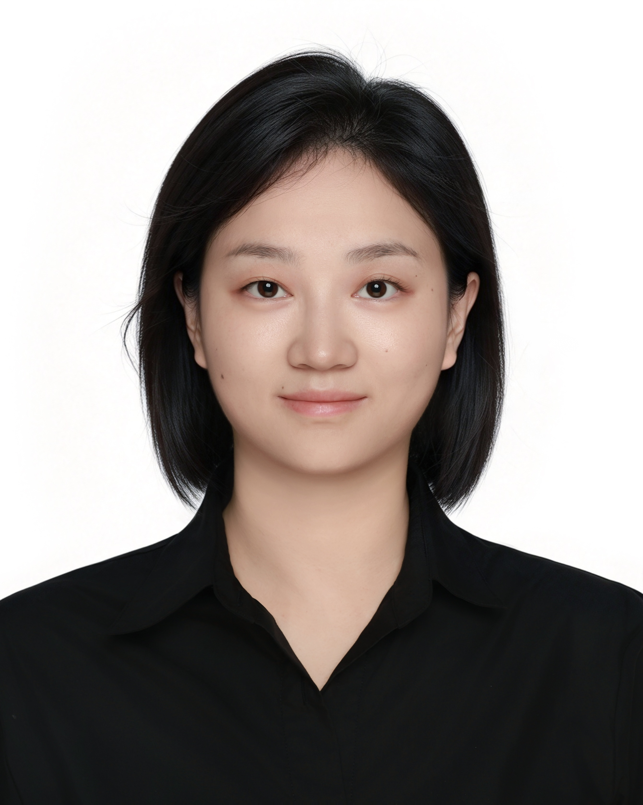

::: {.grid style="--bs-gutter-x: 300px; width: 95%; max-width: 1600px; margin: 0 auto; padding: 80px 0 0 0;"}

::: {.g-col-3}

{style="width: 100%; height: auto; max-height: none; object-fit: cover; border-radius: 50%;"}

:::

::: {.g-col-9 style="padding: 0; margin: 0; text-align: left;"}

**Welcome! I am Yi XIANG (向意)**

I am an Econ Ph.D. candidate in the Business School at the University of Hong Kong (HKU). I received my master’s degree from the Chinese University of Hong Kong and my bachelor’s degree from Sichuan University. I will be on the job market in 2026-2027.

You can reach me at: **[xiangyi@connect.hku.hk](mailto:xiangyi@connect.hku.hk)**

:::

:::
