Some Happiness Snapshots During My Ph.D.

::: {.grid}

::: {.g-col-3}
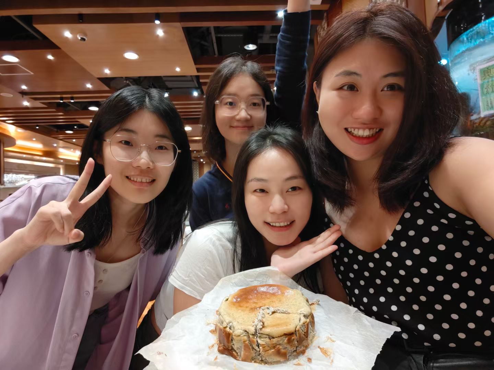{style="width: 100%; object-fit: cover; border-radius: 8px;"}
:::

::: {.g-col-3}
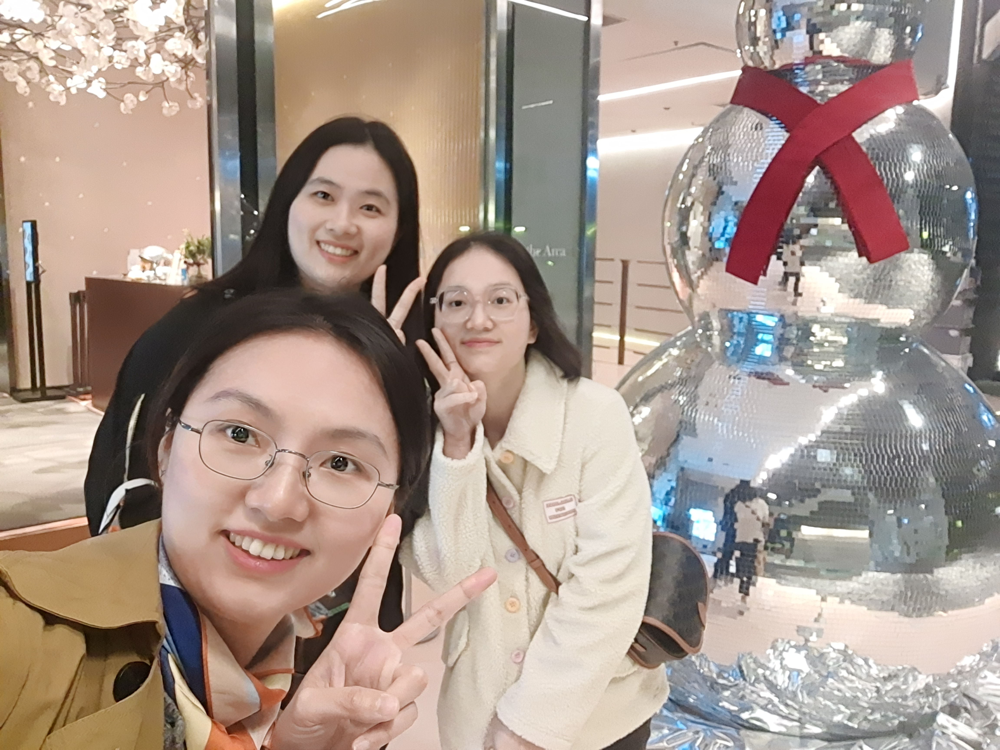{style="width: 100%; object-fit: cover; border-radius: 8px;"}
:::

::: {.g-col-3}
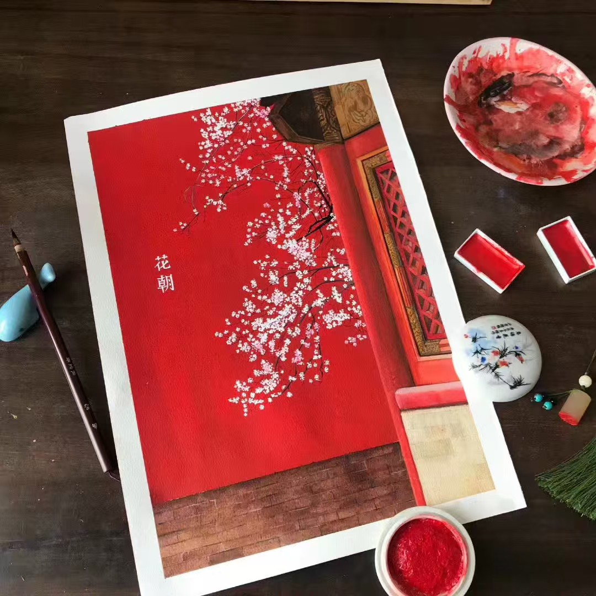{style="width: 100%; object-fit: cover; border-radius: 8px;"}
:::

::: {.g-col-3}
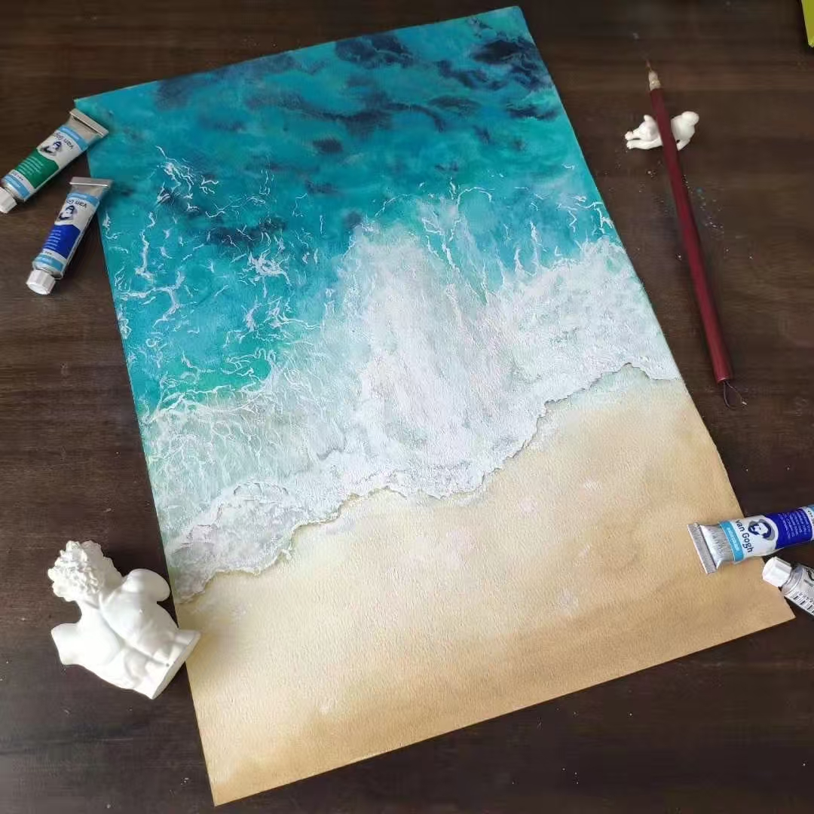{style="width: 100%; object-fit: cover; border-radius: 8px;"}
:::

::: {.g-col-3}
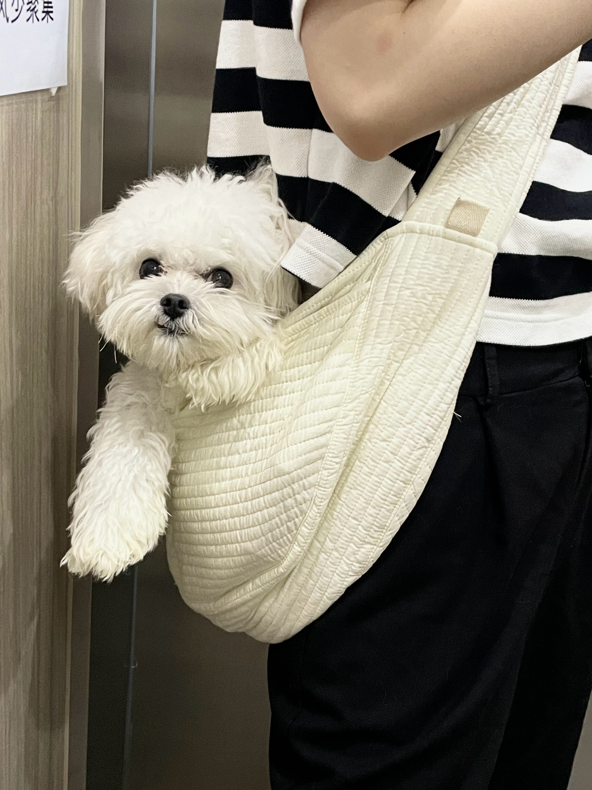{style="width: 100%; object-fit: cover; border-radius: 8px;"}
:::

::: {.g-col-3}
{style="width: 100%; object-fit: cover; border-radius: 8px;"}
:::

::: {.g-col-3}
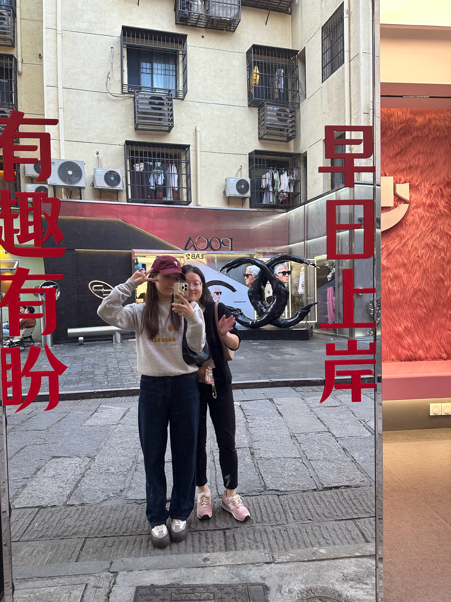{style="width: 100%; object-fit: cover; border-radius: 8px;"}
:::

::: {.g-col-3}
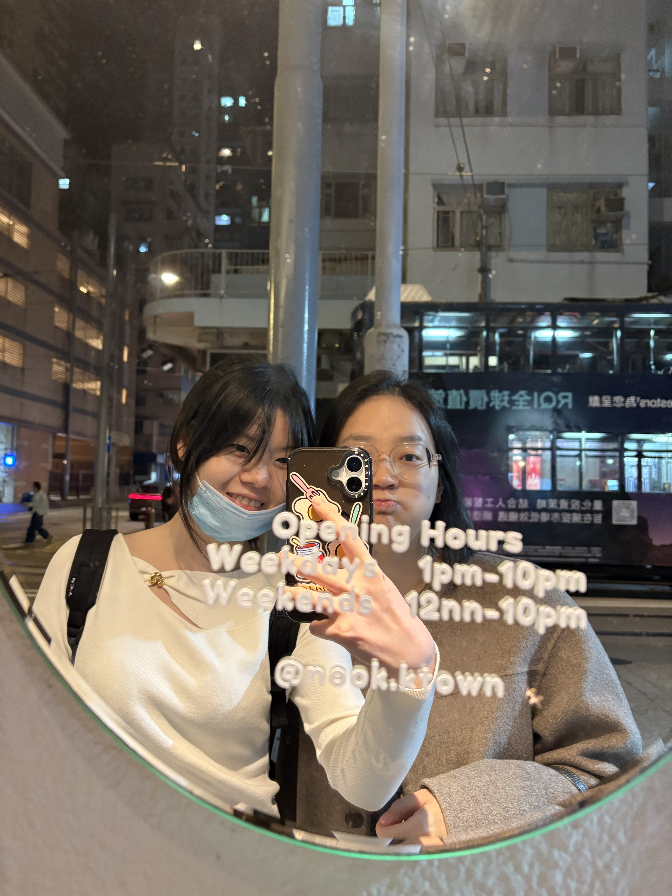{style="width: 100%; object-fit: cover; border-radius: 8px;"}
:::

::: {.g-col-3}
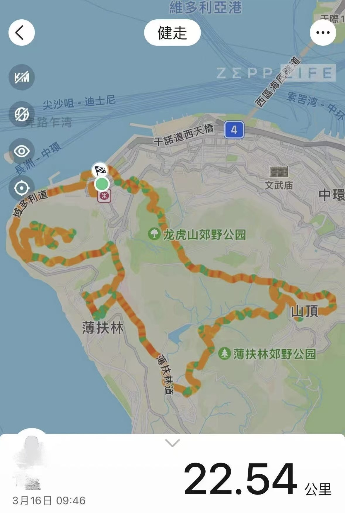{style="width: 100%; object-fit: cover; border-radius: 8px;"}
:::

::: {.g-col-3}
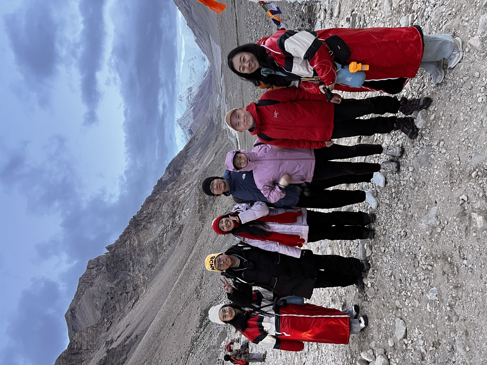{style="width: 100%; object-fit: cover; border-radius: 8px;"}
:::

::: {.g-col-3}
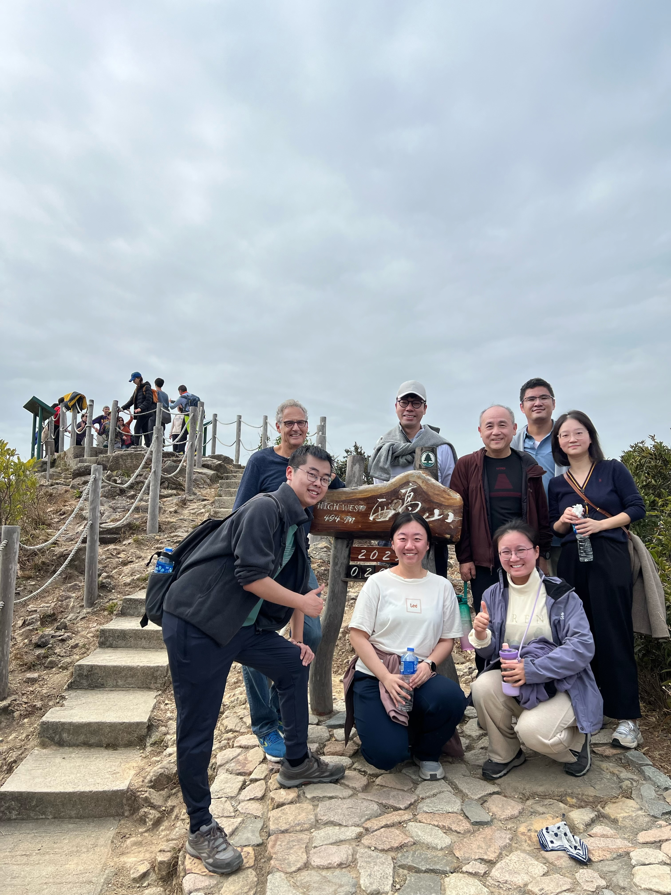{style="width: 100%; object-fit: cover; border-radius: 8px;"}
:::

::: {.g-col-3}

  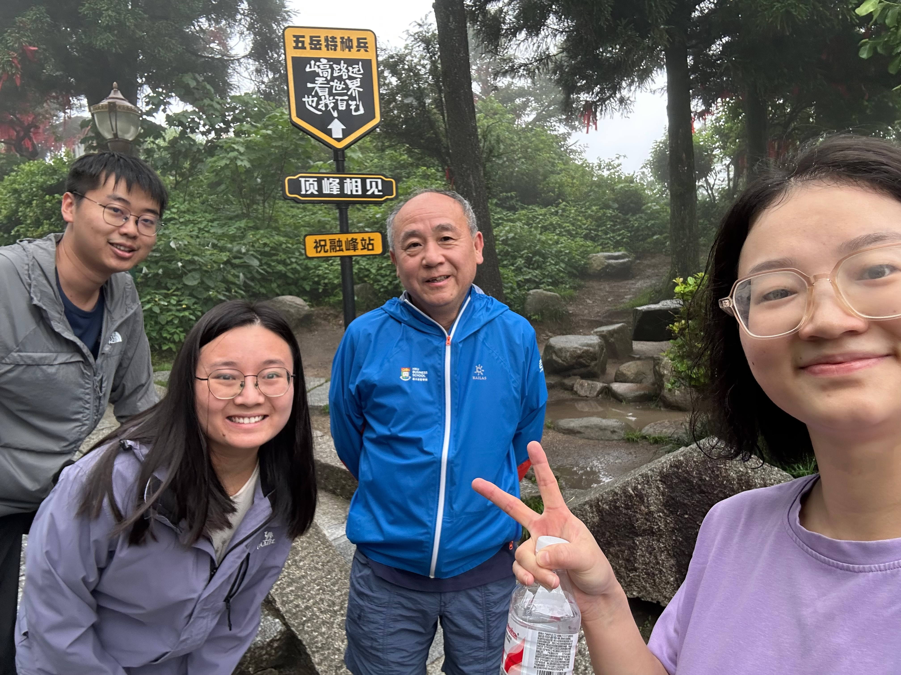{style="width: 100%; object-fit: cover; border-radius: 8px;"}
  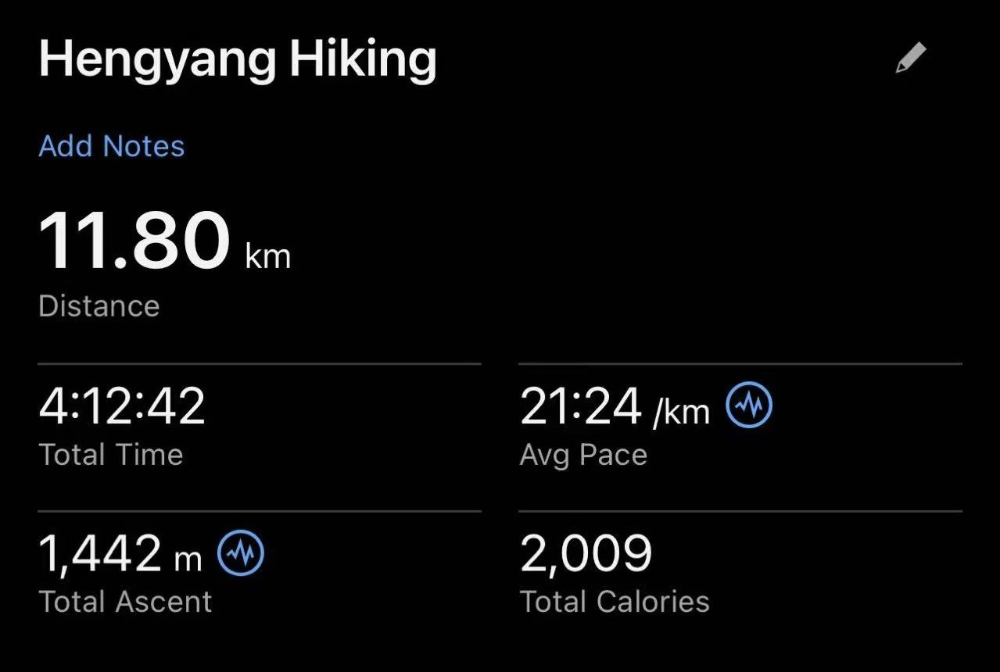{style="width: 100%; object-fit: cover; border-radius: 8px;"}

:::

:::
